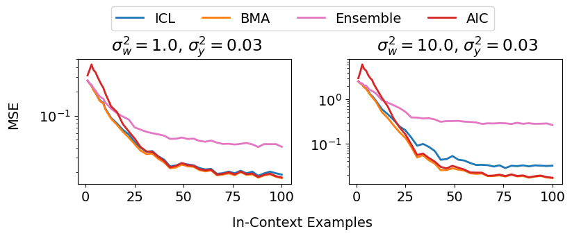
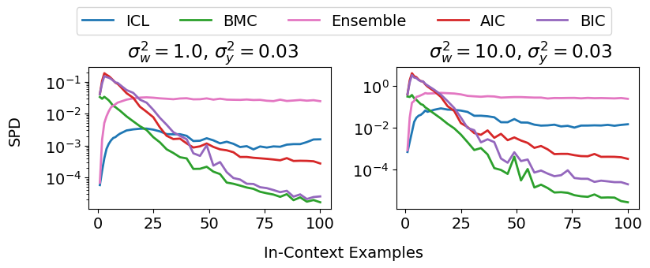

This repository contains the code for our paper:

**Technical Debt in In-Context Learning: Diminishing Efficiency in Long Context** <br>
*Taejong Joo, Diego Klabjan* <br>
Paper: https://arxiv.org/abs/2502.04580 <br><br>


In the paper, we demonstrate that the convenience of in-context learning, which enables adaptation to a new task by conditioning on demonstrations in an input prompt, comes with a hidden cost. While it matches the efficiency of a Bayes-optimal estimator in few-shot settings, we prove its statistical efficiency fundamentally diminishes over long contexts. This reveals a critical trade-off between ICL's flexibility and its long-term statistical efficiency.


 


# Experiments

The experiments are split into two main stages: pre-training the models and evaluating their performance.

## Setup 
Install the required dependencies using pip:
```
pip install -r requirements.txt
```

## Pre-Training

To pre-train a model with the meta ICL objective, run the `train.py`. You must provide a configuration file as an argument.

```
CUDA_VISIBLE_DEVICES=0 python train.py --config conf/main/w_10_ep_01_gauss.yaml
```

- `conf` directory contains all the configuration files used to produce the results in our paper.

## Evaluation

After pre-training, use `prepare_benchmark.py` to generate predictions from the transformer using ICL. This script also computes reference predictions from several principled learning algorithms (e.g., Bayesian model averaging) for comparison.

```
CUDA_VISIBLE_DEVICES=0 python prepare_benchmark.py --model_dir ../main/w_1_ep_01
 
 conf/main/w_10_ep_01_gauss.yaml
```

# Reference

A significant portion of this codebase is adapted from the following repositories. We are grateful for their great contributions to the community.
- https://github.com/dtsip/in-context-learning
- https://github.com/mdrpanwar/icl-bayesian-prism


